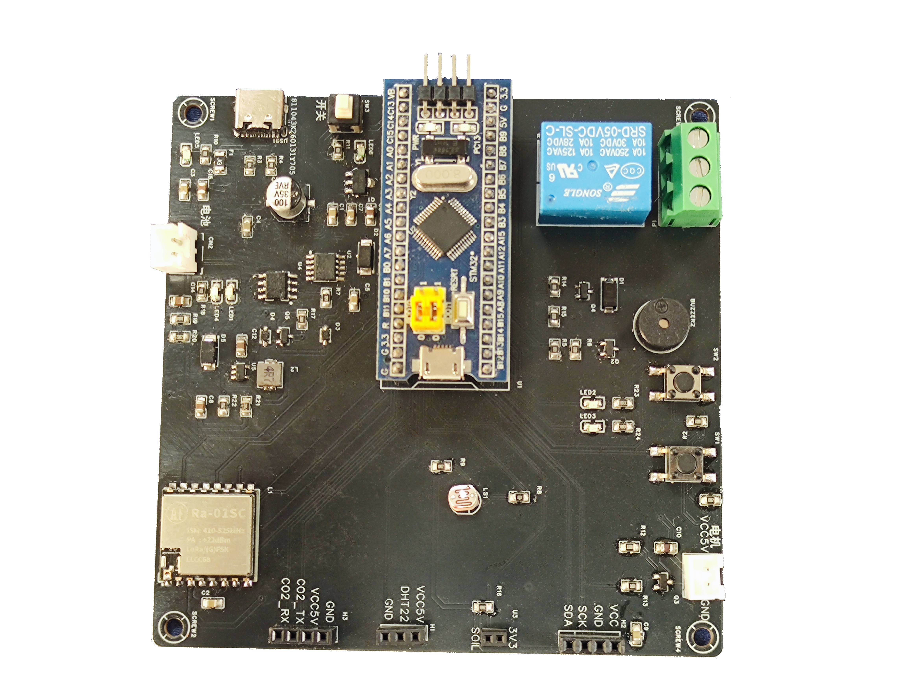

# 高校实验室精密设备环境智能监护与告警系统

基于 **STM32F103C8T6** 的实验室环境监护设备端固件（毕设项目）。

终端节点多传感器高精度采集 → **LoRa 组网**上报 → 中控汇总显示 → **ESP8266 + MQTT** 接入巴法云物联网平台，
云端支持远程监控、历史数据查询与超标告警推送，并可对接小爱音箱语音查询。



---

## 一、项目简介

针对高校实验室精密仪器对温湿度、光照、环境湿度的严格存储运行要求，开发专用环境监护系统：

- 基于 STM32F103 主控，依托 HAL 库完成 **ADC + DMA、I2C、SPI、USART、EXTI、TIM** 等外设配置；
- 高精度采集实验室**空气温湿度、光照强度、台面环境湿度（接触式湿度探头）、CO₂ 浓度**参数，
  避免高湿、强光、高温环境损坏精密设备；
- 自研**裸机时间片轮转调度**：占用同一颗 MCU，分时并行实现高频采集、数据校验、串口日志、
  无线上报、云端定时上报、异常中断告警等多路任务；
- 采用 **LoRa 组网**实现多实验室点位监测，中控节点集中汇总；
- 通过 **WiFi + MQTT** 接入巴法云物联网平台，全天候上传环境数据；管理人员可远程监控、
  查询历史数据、接收超标弹窗告警，支持**小爱音箱语音查询**实验室环境状态与异常播报。

> 本仓库 = 设备端两套固件（终端 + 中控/接收端）源码、CubeMX 工程与硬件资料。
> 手机小程序与语音技能运行在巴法云云端，不在本仓库内。

---

## 二、系统架构

```
┌────────────────────────────────┐          ┌────────────────────────────────┐
│  终端节点（终端-send/）          │          │  中控 / 接收端（中控-recv/）      │
│                                │          │                                │
│  · DHT22      空气温湿度        │          │  · LoRa 常驻接收 + 回 ACK       │
│  · GL5528     光照强度(ADC)     │   LoRa   │  · OLED 实时显示上报数据         │
│  · YX55769    台面湿度(ADC)     ├─────────►│  · ESP8266 WiFi + MQTT 上云     │
│  · CO2 传感器  (USART2)         │ 470.5MHz │                                │
│  · OLED 显示 / 蜂鸣器 / 光控LED  │          │                                │
└────────────────────────────────┘          └───────────────┬────────────────┘
                                                            │ MQTT / TCP
                                                            ▼
                                              巴法云物联网平台（bemfa.com）
                                                            │
                                             ┌──────────────┴───────────────┐
                                             ▼                              ▼
                                    手机小程序 / 云端控制台            小爱音箱语音查询
```

- 两块板是**同一款自研 PCB**（开源硬件资料见 `hardware/`），烧不同固件分饰两个角色；
- 终端每 **2.5 s** 上报一包 10 字节传感器数据，中控收到后回 ACK 并转为 MQTT 上云；
- 系统还含一块网关板（ESP8266 + NB-IoT + LoRa + OLED，原理图同样在 `hardware/`），
  其固件不在本仓库，中控已单独承担上云职能。

---

## 三、功能特性

| 功能 | 说明 |
|------|------|
| 多参数采集 | 空气温湿度（DHT22 单总线）、光照强度（GL5528 + ADC 查表）、台面湿度等级（YX55769 + ADC 查表）、CO₂ 浓度（串口模块） |
| 时间片轮转调度 | 主循环按毫秒级时间片分时推进各任务（采集 / 告警 / 显示 / 上报 / 上云），每路任务独立计时基准，互不阻塞 |
| LoRa 组网 | LLCC68（Ra-01SC）470.5 MHz / SF9 / BW125，终端定时上报 + 中控常驻接收，帧头校验 + ACK 确认 + 窗口重试 |
| 本地告警 | CO₂ 三档蜂鸣器报警（<500 或 >2000 大声；500–800 / 1500–2000 小声；中间区间不响），按键静音自锁；光敏自动三段调光 |
| OLED 显示 | SSD1306 128×64 实时显示温湿度 / 光照 / CO₂ / 台面湿度，支持**运行中热插拔**，不插屏不影响其他功能 |
| 云端接入 | 中控经 ESP8266 AT 指令 + MQTT 3.1.1 接入巴法云，5 个主题定时发布、心跳保活、断线自动整链重连 |
| 可靠性设计 | 中断只置标志位、业务在主循环处理；I2C/串口全部带超时；HardFault 硬件异常现场报告（HFSR/CFSR 寄存器解析） |

---

## 四、硬件平台

### 4.1 核心器件

| 器件 | 型号 | 接口 / 说明 |
|------|------|-------------|
| 主控 | STM32F103C8T6（LQFP48） | 72 MHz，64 KB Flash / 20 KB RAM，HSE 8 MHz × PLL9 |
| LoRa 射频 | LLCC68（安信可 Ra-01SC 模块） | SPI1，NSS/RST/BUSY/DIO1 四线控制 + 中断 |
| 显示屏 | SSD1306 OLED 128×64 | I2C1（100 kHz，地址 0x78） |
| 温湿度 | DHT22 / AM2302 | 单总线（软件模拟时序） |
| 光照 | GL5528 光敏电阻 | 10 kΩ 分压 → ADC1_IN0，查表转 lux |
| 台面湿度 | YX55769 湿度探头 | 10 kΩ 分压 → ADC1_IN1，查表转等级 1~4 |
| CO₂ | 串口式 CO₂ 模块 | USART2 @9600，6 字节定长帧，主动周期上报 |
| WiFi（仅中控） | ESP8266-12E | USART2 @115200，AT 指令 + TCP 透传 |
| 提示外设 | 无源蜂鸣器 3 kHz、LED×3、按键×2 | TIM4_CH4 / TIM1 PWM / EXTI |
| 供电 | Type-C + TP4056 锂电充电 + MT3540-F25 升压 | 输出 5 V / 3.3 V |

### 4.2 引脚分配（终端 / 中控对照）

| 功能 | 引脚 | 终端（send） | 中控（recv） |
|------|------|:---:|:---:|
| 光照 ADC1_IN0 | PA0 | ✔ | — |
| 台面湿度 ADC1_IN1 | PA1 | ✔ | — |
| CO₂ / WiFi 串口 | PA2 / PA3（USART2） | CO₂ @9600 | ESP8266 @115200 |
| LoRa SPI | PA5 / PA6 / PA7（SPI1） | ✔ | ✔ |
| LoRa 片选 / 复位 / 忙 / 中断 | PA4 / PB1 / PB0 / PB10（EXTI10） | ✔ | ✔ |
| 调试串口 | PA9 / PA10（USART1 @115200） | ✔ | ✔ |
| OLED | PB6 / PB7（I2C1） | ✔ | ✔ |
| 光控 LED | PA8（TIM1_CH1）、PB15（TIM1_CH3N） | ✔ | ✔ |
| 蜂鸣器 | PB9（TIM4_CH4，3 kHz） | ✔ | ✔ |
| 按键 SW1 / SW2 | PB13 / PB12（EXTI 下降沿+上拉） | ✔ | ✔ |
| 板载 LED | PC13 | ✔ | ✔ |
| DHT22 单总线 | PC15 | ✔ | — |
| ADC1 + DMA | — | 双通道扫描 + DMA 循环搬运 | 未启用（无对应传感器） |

> ⚠ 两块板 `.ioc` 的差异**只有上表末尾三项**（PA0 / PA1 / PC15 及其 ADC1+DMA），其余完全一致。

### 4.3 硬件资料

| 文件 | 内容 |
|------|------|
| [`hardware/SCH_智慧农业终端_2026-03-29.pdf`](hardware/SCH_智慧农业终端_2026-03-29.pdf) | 终端/中控板原理图（两块板同一款 PCB） |
| [`hardware/SCH_智慧农业网关_2026-03-29.pdf`](hardware/SCH_智慧农业网关_2026-03-29.pdf) | 网关板原理图（固件不在本仓库） |
| [`hardware/LoRa终端.jpg`](hardware/LoRa终端.jpg) | 终端节点实物照片 |
| [`hardware/LoRa网关.jpg`](hardware/LoRa网关.jpg) | 网关板实物照片 |

---

## 五、软件架构

### 5.1 分层设计

```
终端-send/ 或 中控-recv/
├── Core/               CubeMX 生成代码（main / gpio / tim / usart / i2c / spi / adc / dma / 中断向量）
├── Drivers/            STM32F1xx HAL 库 + CMSIS
├── MDK-ARM/            Keil MDK 工程（TMPLATE.uvprojx，ARMCC V5 编译器）
├── TMPLATE.ioc         STM32CubeMX 工程文件（改外设配置从它重新生成）
└── User/               自写业务代码
    ├── app/app_main.c          主循环：时间片轮转调度的总入口
    ├── bsp/
    │   ├── ISR_callback.c      全部中断回调汇集处（EXTI、串口空闲中断）
    │   ├── debug/              调试串口 printf 重定向 + HardFault 现场报告
    │   ├── PWM/                光控 LED 三段调光
    │   ├── beep/               蜂鸣器 CO₂ 三档报警 + 静音自锁        〔仅终端〕
    │   ├── co2/                CO₂ 串口驱动（定长帧解析）           〔仅终端〕
    │   ├── dht/                DHT22 单总线驱动                     〔仅终端〕
    │   ├── light-R/            光照 lux 查表                        〔仅终端〕
    │   ├── soil/               台面湿度等级查表                     〔仅终端〕
    │   └── led/ alarm/         流水灯测试、早期报警模块（保留参考）
    ├── oled/                   SSD1306 驱动 + 四行数据上屏 + 热插拔恢复
    ├── LoRa/                   LLCC68 厂商驱动 + lora_app 应用层（非阻塞状态机）
    └── MQTT/                   ESP8266 AT 驱动 + MQTT 报文层 + 上云应用层 〔仅中控〕
```

### 5.2 时间片轮转主循环

主循环是自研的**裸机时间片轮转调度**：每个任务有独立的计时基准，按各自周期分时推进，
无阻塞等待、无 RTOS 开销；中断只置标志位，业务统一在主循环消费。

**终端（send）**：

| 任务 | 周期 | 说明 |
|------|------|------|
| CO₂ 采集与三档告警 | 1 s | 100 ms 超时，失败自动静音 |
| DHT22 温湿度采集 | 2 s | 单总线，失败保留上次值并在屏上显示 `--` |
| 光控 LED | 500 ms | 按 lux 三段自动调光（100% / 50% / 15%） |
| OLED 刷新 | 500 ms | 四行数据，只重画数值区 |
| LoRa 上报状态机 | 2.5 s | 开 500 ms 接收窗口等指令 → 发 10 字节数据 → 开 400 ms 窗口等 ACK |

**中控（recv）**：

| 任务 | 周期 | 说明 |
|------|------|------|
| LoRa 常驻接收 | 事件驱动 | 收到即校验、解析、回 ACK（排在主循环第一位，保证 ACK 最快） |
| MQTT 上云 | 发布 5 s / 心跳 60 s / 断线重试 15 s | 非阻塞状态机，发布最新一包数据 |
| OLED 刷新 | 收到新包即刷 + 2.5 s 兜底 | 与终端上报周期对齐 |

### 5.3 关键设计点

- **中断只置标志位**：DIO1（LoRa 收发完成）、按键等中断只写一个 volatile 标志，业务在主循环处理；
- **收发窗口预算**：一轮 500 + 145（空中）+ 400 = 1045 ms < 2500 ms，留足余量；
- **OLED 热插拔**：所有 I2C 写先查在线标志（离线零耗时直返），写失败即置离线，重新插入自动探测重初始化；
- **HardFault 现场报告**：硬件异常时打印 HFSR/CFSR/MMFAR/BFAR 并翻译为中文原因，原地停机保留现场（直接操作 USART1 寄存器，不依赖 printf）；
- **私密配置外置**：WiFi 账号密码与巴法云私钥放在 `User/MQTT/wifi_config.h`（已 gitignore，模板见 `wifi_config.example.h`）。

---

## 六、通信协议

完整的外设与通信协议说明见 **[`docs/外设与通信协议说明.md`](docs/外设与通信协议说明.md)**（逐项核对 `.ioc` 与生成代码整理）。

### 6.1 LoRa 空中帧（终端 ↔ 中控）

射频参数：**470.5 MHz / SF9 / BW125 kHz / CR 4-5 / 前导码 8 / 显式头 / CRC 开**（两端必须完全一致）。

**上行（终端 → 中控），固定 10 字节，多字节字段小端：**

| 偏移 | 长度 | 字段 | 说明 |
|:---:|:---:|------|------|
| 0 | 1 | 帧头 | `0xAA` |
| 1 | 1 | 设备 ID | 终端地址（当前 `0x01`，可扩展多节点） |
| 2–3 | 2 | 光照 | int16，单位 lux |
| 4 | 1 | 台面湿度等级 | 1~4 |
| 5–6 | 2 | 温度 | int16，单位 0.1 ℃；`-32768` 表示未读到 |
| 7 | 1 | 空气湿度 | %RH |
| 8–9 | 2 | CO₂ 浓度 | uint16，单位 ppm；`0xFFFF` 表示未读到 |

**下行（中控 → 终端）**：`0xAA` + 设备 ID + 负载；负载首字节为指令码，
目前只有 `0x01`（ACK），即整帧 3 字节。

> ⚠ 帧格式在两个工程的 `User/LoRa/lora_app.h` 中**各存一份**，修改时必须同步改两边。

### 6.2 MQTT 上云（中控 → 巴法云）

- 连接：`bemfa.com:9501`，MQTT 3.1.1，ClientID 即巴法云私钥；
- 五个主题与控制台逐字对应（区分大小写），负载为巴法云 `#` 格式（单值也要带 `#`）：

| 主题 | 内容 | 示例负载 |
|------|------|---------|
| `Humidity` | 空气湿度 %RH | `#61` |
| `Temperature` | 气温 ℃（一位小数） | `#29.0` |
| `light` | 光照 lux | `#124` |
| `soil` | 台面湿度等级 1~4 | `#1` |
| `co2` | CO₂ ppm | `#720` |

- 采集项失效时发 `#--`（不发送哨兵原始值）；
- 发布到 `<主题>/set`；同时订阅五个主题以接收小程序下发消息（当前仅打印）。

---

## 七、快速开始

### 7.1 开发环境

| 工具 | 版本 |
|------|------|
| Keil MDK-ARM | V5（工程使用 ARMCC **V5** 编译器，非 AC6） |
| STM32CubeMX | 6.16（仅改外设配置时需要） |
| 调试器 | J-Link |
| 串口助手 | 任意，115200 8N1 |

### 7.2 编译与烧录

```text
1. （仅中控首次使用）把 中控-recv/User/MQTT/wifi_config.example.h 复制为
   wifi_config.h，填入自己的 WiFi 名称、密码和巴法云私钥。

2. Keil 打开 <工程>/MDK-ARM/TMPLATE.uvprojx，Rebuild（0 Error）。

3. J-Link 分别烧录两块板：
     终端-send/  → 烧到采集端
     中控-recv/  → 烧到接收端

4. 串口 115200 观察日志：
     终端：轮转打印 CO2 / 温湿度 / 光照 / 土壤，以及「LoRa上报完成」「LoRa收到中控ACK」
     中控：「中控收到: 节点=.., 光照=.., ..., CO2=.. ppm」与「MQTT上云：Humidity<-#61 ...」
```

### 7.3 云端配置（巴法云）

在巴法云控制台创建上表五个主题（名称逐字一致），绑定手机小程序与「小爱同学」技能后，
即可远程查看数据、接收超标告警与语音查询。

---

## 八、资源占用

| 工程 | Flash（Code+RO+RW） | RAM（RW+ZI） | 编译结果 |
|------|:---:|:---:|:---:|
| 终端-send | 34.6 KB / 64 KB | 2.0 KB / 20 KB | 0 Error |
| 中控-recv | 34.3 KB / 64 KB | 2.3 KB / 20 KB | 0 Error |

> 编译存在少量既有警告（中文标点 `#870-D`、文件末尾缺换行 `#1-D` 等），不影响运行。

---

## 九、已知限制

- **中控连接云端时会短暂阻塞**：`ESP_Init()` 为阻塞式 AT 流程，链路不通时单次最坏约 27 s
  （WiFi 重试 15 s 一次），期间 LoRa 接收会漏包、ACK 迟发；连上后不再进入该分支。
  这是「宁可漏包也不让云端故障卡死整板」的刻意取舍；
- **CO₂ 数据存在一个采样周期的滞后**：CO₂ 1 s 采样、2.5 s 上报，帧内取值最多差 1 s；
- **两端帧格式强耦合**：上行帧长度/字段一改，两个工程必须同步修改并同时重烧；
- 中控不按设备 ID 过滤（靠射频 CRC 保障），为后续扩展多节点保留灵活性；
- 板载继电器接口（PC14）未在 CubeMX 中启用，当前固件不可用。

---

## 十、第三方组件与许可

| 组件 | 来源 / 许可 |
|------|-------------|
| LLCC68 射频驱动（`User/LoRa/llcc68*`） | Semtech 官方驱动，Clear BSD License（见 `User/LoRa/LICENSE.txt`） |
| SSD1306 OLED 驱动与字库（`User/oled/`） | 厂商提供参考代码 |
| MQTT 报文层（`User/MQTT/mqtt.c`） | 参考巴法云示例改写 |
| 其余业务代码 | 本项目自写 |

本仓库为个人毕业设计作品，未附开源许可证；如需引用请联系作者。

---

## 十一、相关文档

| 文档 | 位置 |
|------|------|
| 外设与通信协议说明（引脚 / 链路 / 帧格式 / 中断优先级） | [`docs/外设与通信协议说明.md`](docs/外设与通信协议说明.md) |
| 终端节点固件 | `终端-send/` |
| 中控（接收端）固件 | `中控-recv/` |
| 原理图与实物照片 | `hardware/` |
